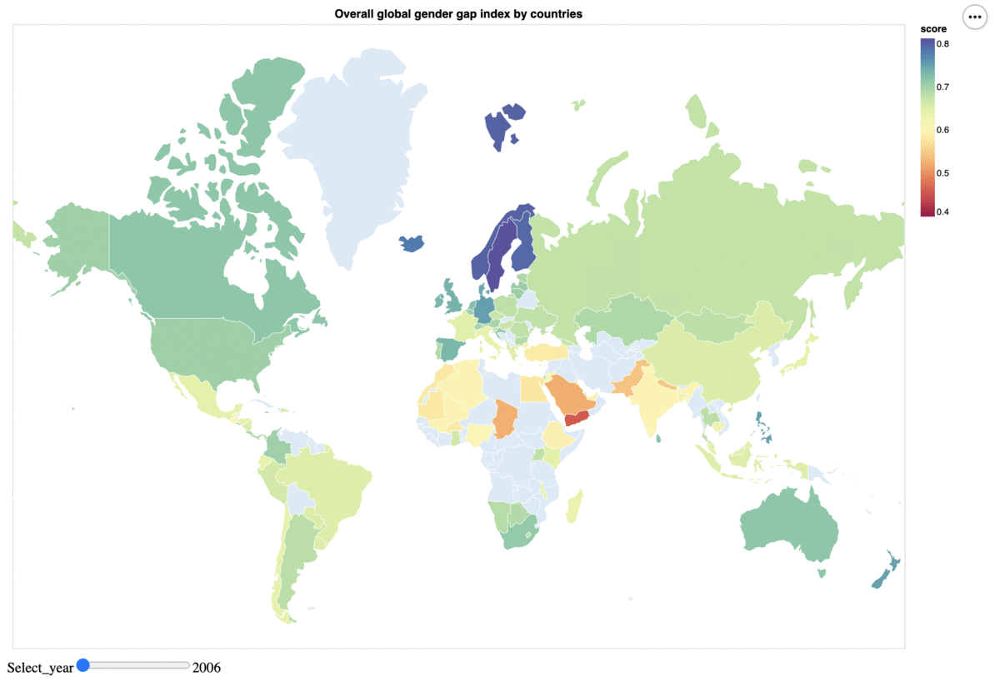
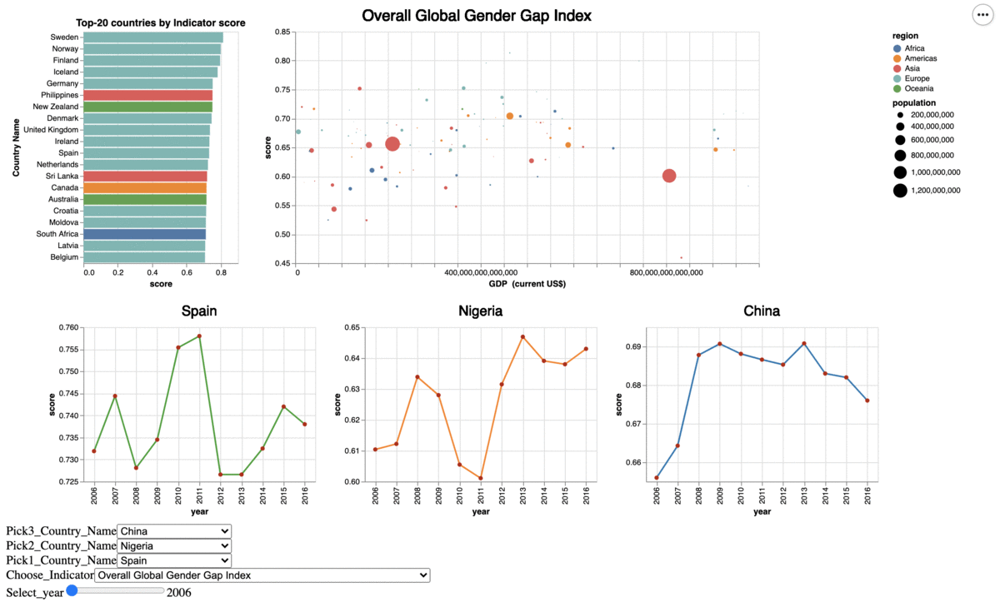

## Gender gap between countries around the world

##### INFORMATION VISUALIZATION

**Bachelor Degree in Data Science and Engineering** - Marta Carbonell Cabutí, Alex Carrillo Alza (UPC)

December, 2019

> *Preface*. Gender parity is fundamental to whether and how economies and societies thrive. Ensuring the full development and appropriate deployment of half of the world's total talent pool has a vast bearing on the growth, competitiveness and future-readiness of economies and businesses worldwide.

This project aims to create a visualization to interactive explore whether there is a gender gap in some indicators between different countries. The contribution of this visualization is twofold. On the one hand, we want to display a world map showing the overall gender gap that each country has had over a decade. More concretely, that is showing the **Overall Global Gender Gap Index** of every country in the world over the period of **2006 and 2016**, i.e. eleven years, by plotting a colored **choropleth map**.

On the other hand, the second part aims to dig deeper into the factors that trigger an increase or a decrease in this overall inequality index in order to be able to decode it. Specifically, it means to display a **bubble chart** of the **Overall Global Gender Gap Index** and four more indicators: the **Global Gender Gap Political Enpowerment Subindex**, the **Global Gender Gap Economic Participation and Opportunity Subindex**, the **Global Gender Gap Educational Attainment Subindex** and the **Global Gender Gap Health and Survival Subindex**, versus the **GDP Per Capita (US$)** and also considering the **Population Size**; all the above again over the period of **2006 and 2016**, i.e. eleven years. Furthermore, to ease the task of ranking countries based on these indicators, we display a **ranked bar char** of the **top-20 countries by index**, over the same period of time. And we provide a **three-countries timeline comparison** of those same indicators, over the same period of time.

